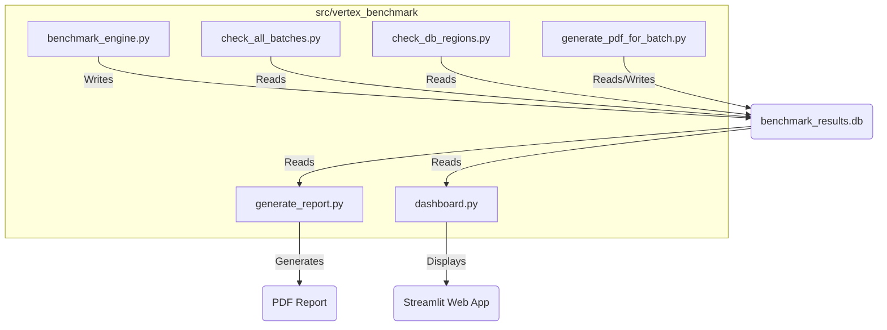
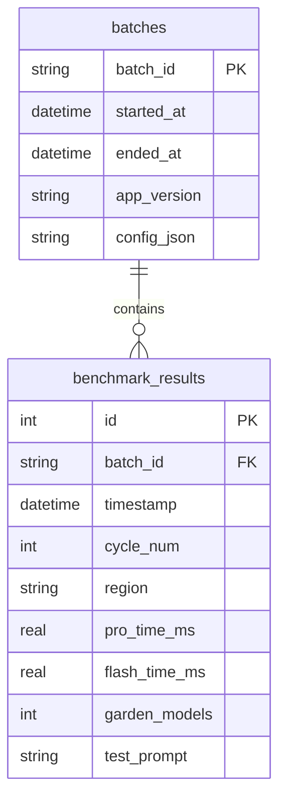
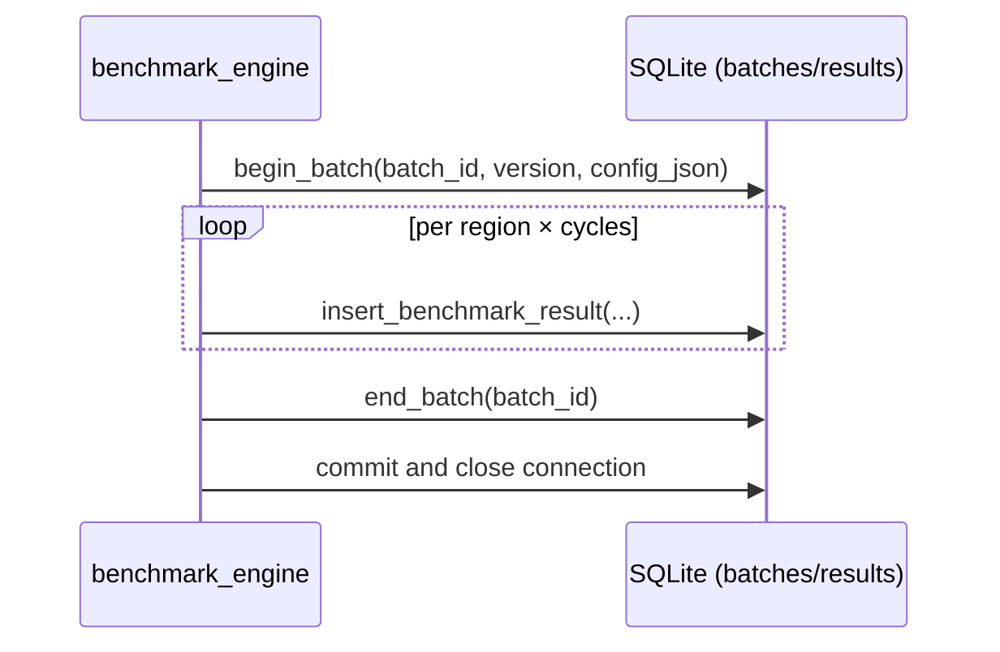
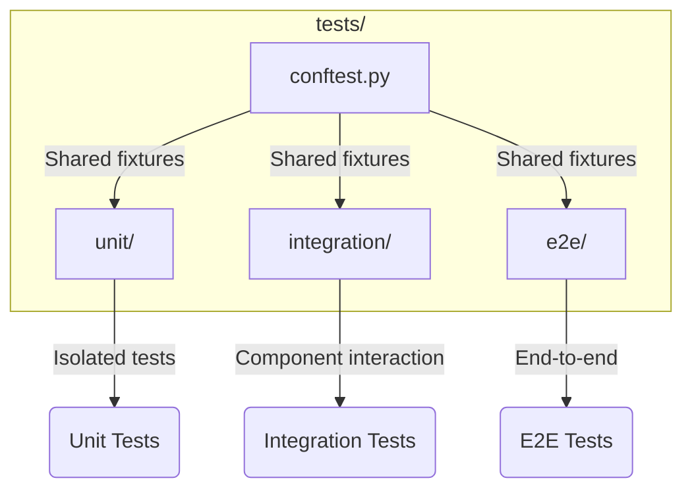

# Architecture

This document provides a high-level overview of the Vertex AI Gemini Performance Benchmarking tool's architecture, reflecting the current `src` layout.

## Application Workflow

The application follows a simple yet effective workflow. All core logic is contained within the `vertex_benchmark` package under `src/`.

1.  **Benchmarking**: The `vertex_benchmark.benchmark_engine` module runs performance tests across various regions, collecting response time data.

2.  **Data Storage**: The results are stored in a SQLite database (`benchmark_results.db`), which is managed by the `vertex_benchmark.database_utils` module.

3.  **Reporting**: The `vertex_benchmark.generate_report` module generates a PDF report summarizing the benchmark results.

4.  **Visualization**: The `vertex_benchmark.dashboard` module launches a Streamlit web application that provides an interactive dashboard for exploring the benchmark data.

## Database Schema

The database schema is designed to store the benchmark results and associated metadata. It consists of two main tables:

-   **`benchmark_results`**: Stores the raw performance data for each test cycle.
-   **`batches`**: Stores metadata for each benchmark run.

Here's a Mermaid diagram illustrating the database schema:

This schema allows for efficient storage and retrieval of benchmark data, enabling detailed analysis and reporting.

Indexes and PRAGMAs:
- Composite index on `benchmark_results(batch_id, region)` for report queries.
- SQLite PRAGMAs: `journal_mode=WAL`, `synchronous=NORMAL)` to balance durability and throughput.

### Batch lifecycle (sequence)

## Report Generation Details

- Averages computed per region across all cycles for Pro/Flash.
- Executive Summary shows fastest/average/slowest (per model).
- Detailed table includes status per region (Full/Partial/None) and color bands (fast/medium/slow).
- Key Insights: fastest regions, mean/stdev, p10/p50/p90, Top 3 per model.
- Footer includes timestamp and conditional batch metadata (batch id, version, started/ended, config summary).

## Performance Notes

- Single DB connection reused for the whole run to minimize overhead.
- Small randomized delay between requests; concurrency can be added with a bounded pool if needed.

## Testing Architecture

The project uses a structured testing approach with three distinct test categories organized in the `tests/` directory:

- **`unit/`**: Tests pure helpers (e.g., stats/percentiles).
- **`integration/`**: Tests database helpers with temporary SQLite files.
- **`e2e/`**: DB→PDF flow validations and content checks; PDFs uploaded in CI as artifacts.
- **`conftest.py`**: Shared fixtures and setup.

## CI Overview

- GitHub Actions (`.github/workflows/ci.yml`) with Python 3.13.
- Steps: install runtime + dev deps, run `pytest -q`, upload PDFs from `results/` and `test_results/`.

## Configuration Surface

- `APP_VERSION` included in batch metadata.
- Config snapshot (regions, models, prompts, delays, project id) persisted in `batches.config_json`.